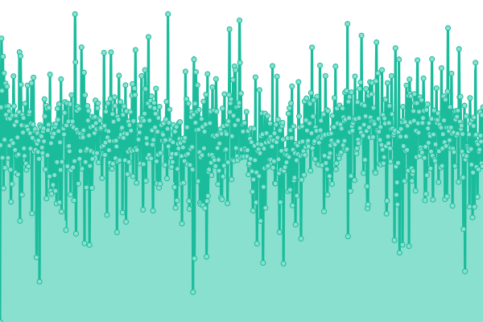
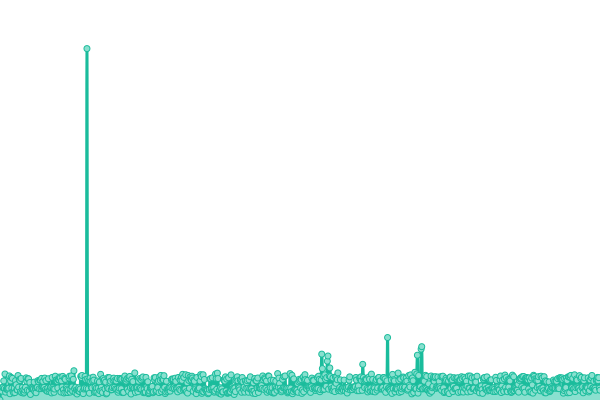
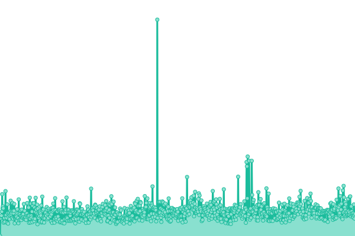
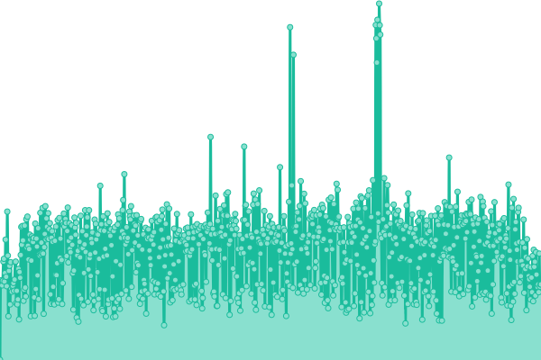

# [📈 Live Status](https://status.hukoubook.com): <!--live status--> **🟩 All systems operational**

This repository contains the open-source uptime monitor and status page for [Smite Chow](https://www.smitechow.com), powered by [Upptime](https://github.com/upptime/upptime).

With [Upptime](https://upptime.js.org), you can get your own unlimited and free uptime monitor and status page, powered entirely by a GitHub repository. We use [Issues](https://github.com/lovemyliwu/uptime/issues) as incident reports, [Actions](https://github.com/lovemyliwu/uptime/actions) as uptime monitors, and [Pages](https://status.hukoubook.com) for the status page.

<!--start: status pages-->
<!-- This summary is generated by Upptime (https://github.com/upptime/upptime) -->
<!-- Do not edit this manually, your changes will be overwritten -->
<!-- prettier-ignore -->
| URL | Status | History | Response Time | Uptime |
| --- | ------ | ------- | ------------- | ------ |
|  [feedgenerator/中国好声音动态源服务](https://feedg.hukoubook.com/.well-known/did.json) | 🟩 Up | [feedgenerator.yml](https://github.com/lovemyliwu/uptime/commits/HEAD/history/feedgenerator.yml) | 

 247ms
     
 | 

<a href="https://status.hukoubook.com/history/feedgenerator">100.00%</a>
    

|  [PDS/个人数据服务](https://network.hukoubook.com/xrpc/_health) | 🟩 Up | [pds.yml](https://github.com/lovemyliwu/uptime/commits/HEAD/history/pds.yml) | 

 219ms
     
 | 

<a href="https://status.hukoubook.com/history/pds">100.00%</a>
    

|  [did:web/身份id服务](https://smite.hukoubook.com/.well-known/did.json) | 🟩 Up | [did-web-id.yml](https://github.com/lovemyliwu/uptime/commits/HEAD/history/did-web-id.yml) | 

 196ms
     
 | 

<a href="https://status.hukoubook.com/history/did-web-id">100.00%</a>
    

|  [bsky_appview/bsky后端服务](https://api.hukoubook.com/xrpc/app.bsky.feed.getAuthorFeed?actor=did%3Aweb%3Asmite.hukoubook.com&filter=posts_and_author_threads&includePins=true&limit=30) | 🟩 Up | [bsky-appview-bsky.yml](https://github.com/lovemyliwu/uptime/commits/HEAD/history/bsky-appview-bsky.yml) | 

 510ms
     
 | 

<a href="https://status.hukoubook.com/history/bsky-appview-bsky">100.00%</a>
    

<!--end: status pages-->

[**Visit our status website →**](https://status.hukoubook.com)

## 📄 License

- Powered by: [Upptime](https://github.com/upptime/upptime)
- Code: [MIT](./LICENSE) © [Anand Chowdhary](https://anandchowdhary.com), supported by [Pabio](https://pabio.com)
- Data in the `./history` directory: [Open Database License](https://opendatacommons.org/licenses/odbl/1-0/)
